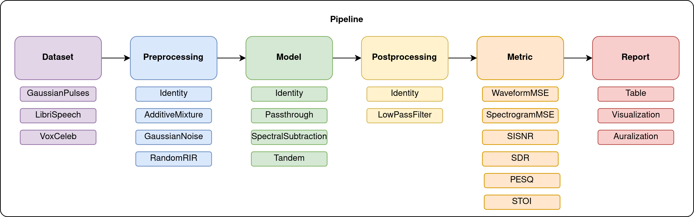

# speech-sep-eval
Speech separation evaluation (speech-sep-eval) enables the evaluation of any method for speech separation. 

The speech-sep-eval evaluates a speech separation models ability to process a mixture signal, consisting of a target speech signal and interferring signals, and output a single target speech signal. The considered interference can be e.g. other speakers (speaker separation) or classic examples of stationary noise (speech enhancement). The comprehensive evaluation seeks to address issues with limited evaluation by enabling an easy-to-use pipeline that enables a multi-dimensional evaluation on e.g. unseen data in reverberent environments.

After having run an setup script, you setup a pipeline: (a) choose datasets to evaluate on, (b) choose which pre-processings to compare, (c) you provide the models, (d) choose post-processing, (e) choose which metrics to calculate, and (f) choose how to report the results. 

## Setup

[Describe setup]

## TODO
- [ ] Pipeline: Pipeline ABC
- [ ] Metric: Metric ABC
- [ ] Preprocessing: Preprocessing ABC
- [ ] Postprocessing: Postprocessing ABC
- [ ] Dataset: Dataset ABC
- [ ] Model: Model ABC
- [ ] Report: Report ABC
- [ ] Metric: SI-SNR
- [ ] Metric: SDR
- [ ] Metric: Waveform MSE
- [ ] Metric: Spectrogram MSE
- [ ] Metric: PESQ
- [ ] Metric: STOI
- [ ] Model: Supplied
- [ ] Model: Passthrough
- [ ] Model: SpectralSubtract
- [ ] Model: Tandem
- [ ] Preprocess: Identity-mapping
- [ ] Preprocess: Additive mixture
- [ ] Preprocess: Random RIR mixture
- [ ] Preprocess: Noise addition parametrized by desired SNR(-ranges); could be dataset, too?
- [ ] Postprocess: Identity-mapping
- [ ] Postprocess: Low-pass filter
- [ ] Setup: Download and setup script for LibriSpeech and VoxCeleb
- [ ] Setup: Download and setup script for a noise datasets
- [ ] Setup: Specify pip requirements
- [ ] Setup: Write setup description
- [ ] Reporting: Export of results in table
- [ ] Reporting: Visualize examples of waveforms, spectrograms, MFCCs
- [ ] Reporting: Auralize examples of best/worst performance
- [ ] Setup simple testing of code as a starting point.
- [ ] Examples: sample pipeline

## Various ideas/considerations
- Metric: ASR improvement based on ESPNet/Kaldi
- How much of this can we get from existing repos? How much should we simply wrap those, if they are available? https://github.com/espnet/espnet and http://kaldi-asr.org/doc/about.html.
- Download and setup script for music datasets (publicly available), television, something like AudioSet, or even examples of various acoustics scenes from a scene classification task. 
- Should this be dockerized?
- Impose characteristics for different hardware through filtering (somewhat like RIR)
- Use more advanced metrics than PESQ/STOI, e.g. [DESQ](https://ieeexplore.ieee.org/document/8682754), or [Helia's measure](https://asa.scitation.org/doi/abs/10.1121/1.5129114).
- Impose a heaing impaired characteristics through a model; is it meaningful to add a simplistic "hearing impairment" simulation by filtering based on audiogram? This would be the reason for the post-processing block (chat with Abbie/Torsten/Raul)
- Stratification of performance/fairness through datasets with labelled demographics such as vox-celeb - chat with Pola
- Simple interpretability considerations on DL systems in this? - chat with Laura/Lars
- Interactive demo notebook that records an audio snippet and runs with that in pipeline
- Metric: MFCC MSE, or other known acoustic features and their change; e.g. F0
- Interface for simple MOS-evaluation and SRT-evaluation, for illustration.
